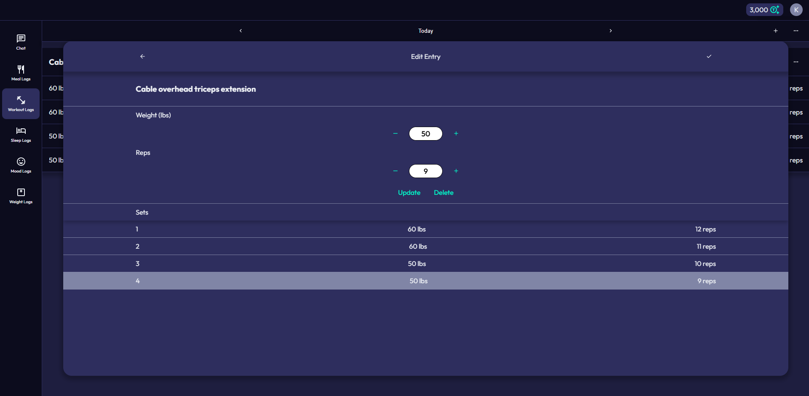
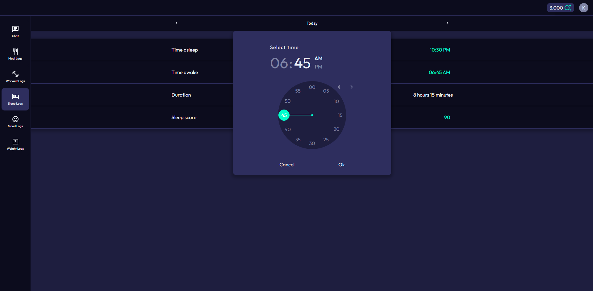

# AI-Fitness-Tracker

  
  <h2 align="center"><a href="https://aitracker.fit">aitracker.fit</a></h2>
  
An AI-powered fitness tracker that generates insights based on diet, exercise, sleep, mood, and bodyweight data.

## Summary

- A full-stack, agentic AI fitness tracker using FastAPI, PostgreSQL, Docker, and EC2.
- Features a GPT-5-powered agent capable of analyzing user health/fitness data via tool calling and retrieval-augmented generation (RAG).
- Implements CI/CD with GitHub Actions, running ~120 Pytest tests, building Docker containers, and deploying to EC2.
- Features a responsive React + TypeScript frontend with HTML/CSS, reusable components, and custom hooks.
- Uses secure authentication (JWTs, HTTP-only refresh tokens), reCAPTCHA, and Nginx for rate/connection limiting.

## Features

### AI Chat Interface
  
*Conversational AI agent that analyzes your health data and provides personalized insights*

### Meal Tracking
  
*Comprehensive nutrition logging with custom food database containing ~2 million foods*

### Exercise Tracking
  
*Detailed workout tracking across ~3,000 exercises, including sets, reps, and performance metrics*

### Sleep Tracking
  
*Sleep pattern tracking with subjective quality scores*

### Weight Tracking
  
*Bodyweight tracking with visual progress charts*

## System Architecture
  
*System architecture diagram*

The application is deployed on a single AWS EC2 instance and composed of multiple Docker containers, with NGINX acting as the public entry point.

User (Browser)
- Interacts with the application via HTTPS.

NGINX (Reverse Proxy)
- Terminates TLS (HTTPS).
- Routes requests to frontend and backend containers.
- Applies rate limiting and connection limits to protect the API.

Frontend Container (React + Vite)
- Serves the single-page application.
- Handles user interaction and state management.
- Communicates with the backend via REST API.

Backend Container (FastAPI + SQLAlchemy)
- Handles authentication and authorization.
- Validates and processes user-submitted health data.
- Exposes REST endpoints consumed by the frontend.
- Orchestrates AI workflow and tool-calling logic.

PostgreSQL Container
- Stores user accounts, health/fitness logs, and chats/messages.
- Accessed by the backend container.

OpenAI API (External Service)
- Provides GPT-5 model inference for the AI agent.
- Queried by the backend for analysis and insight generation.

## User Experience
  
*User flow diagram*

## Database Design
  
*Database schema and entity relationships*
