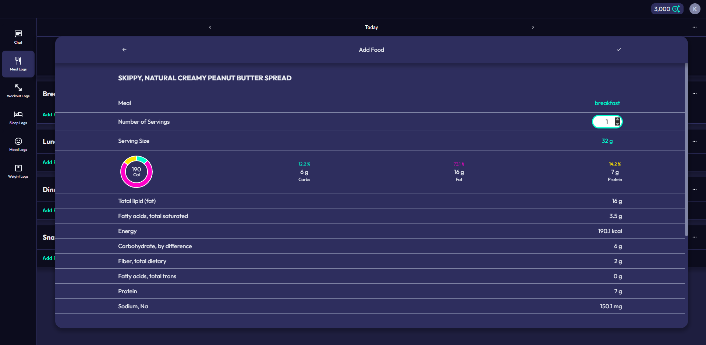

# AI-Fitness-Tracker

An AI-powered fitness tracker that generates insights based on diet, exercise, sleep, and mood data.

- A full-stack, agentic AI fitness tracker using FastAPI, Pydantic, PostgreSQL, SQLAlchemy, Alembic, Docker, and EC2, featuring a GPT-5-powered autonomous agent that can analyze users' health data, interact with the app, call specialized tools, and generate actionable recommendations.
- Implements CI/CD with GitHub Actions, running 121+ Python tests, building Docker containers, and deploying to EC2.
- Features a responsive React + TypeScript frontend with HTML/CSS. Uses secure authentication (JWTs, HTTP-only refresh tokens), reCAPTCHA, and Nginx proxy with rate limiting for production readiness.

# User Stories

## Meal Tracking
- As a user, I want to log the various foods in my meals so that I can track my nutrition over time.
- As a user, I want to be able to add new foods so that I can accurately track what I eat, even if it's not already in the system.

## Exercise Tracking
- As a user, I want to record exercises, sets, reps, rest times, and/or exercise duration so that I can measure my progress over time.
- As a user, I want to view metrics about exercises so that I can evaluate my performance.

## Sleep Tracking
- As a user, I want to log sleep and wake times as well as subjective sleep scores so that I can monitor my sleep patterns.
- As a user, I want to see trends in my sleep duration, consistency, and subjective quality over time so that I can understand how my sleep habits are affecting my overall health.

## Mood Tracking
- As a user, I want to log my subjective mood scores so that I can monitor my emotional well-being over time.
- As a user, I want to see trends in my subjective mood scores over time so that I can identify emotional patterns and understand how my lifestyle affects my mental well-being.

## AI Insights
- As a user, I want to receive personalized health insights based on combining information from my logs as well as past insights so that I can improve my habits.
- As a user, I want AI summaries of specific actions I can take so that I can immediately improve my health and fitness habits.

## User Experience
- As a user, I want the app to be fast and easy to use so that I can quickly get started and build a daily habit without feeling overwhelmed.
- As a user, I want the app to automatically track and organize my health and fitness data over time, as well has remember past insights and conversations so that so that I can get deeper, more personalized insights than I would from one-off prompts to ChatGPT.

## Authentication
- As a new user, I want to register with my email and password so that I can create an account.
- As a returning user, I want to log in securely so that I can access my past data.

## Privacy
- As a user, I want to be confident that my data is private and secure so that I feel safe using the app every day.
- As a user, I want to have the option to delete my account and all associated data so that I can control what information is stored about me.
